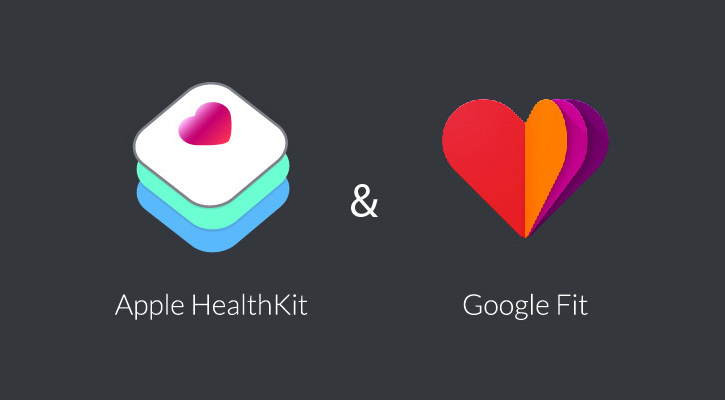

<p align="center">
    
</p>

# Health Data plugin for NativeScript
This is a NativeScript plugin that abstracts Apple HealthKit and Google Fit to read health data from the user's device.

[![Build Status][build-status]][build-url]
[![NPM version][npm-image]][npm-url]
[![Downloads][downloads-image]][npm-url]
[![Twitter Follow][twitter-image]][twitter-url]

[build-status]:https://travis-ci.org/EddyVerbruggen/nativescript-health-data.svg?branch=master
[build-url]:https://travis-ci.org/EddyVerbruggen/nativescript-health-data
[npm-image]:http://img.shields.io/npm/v/nativescript-health-data.svg
[npm-url]:https://npmjs.org/package/nativescript-health-data
[downloads-image]:http://img.shields.io/npm/dm/nativescript-health-data.svg
[twitter-image]:https://img.shields.io/twitter/follow/eddyverbruggen.svg?style=social&label=Follow%20me
[twitter-url]:https://twitter.com/eddyverbruggen

## Prerequisites

### Android
Google Fit API Key - Go to the [Google Developers Console](https://console.developers.google.com/), create a project, and enable the `Fitness API`.
Then under `Credentials`, create a `Fitness API` OAuth2 client ID for an Android App (select `User data` and press the `What credentials do I need?` button).
If you are using Linux/maxOS, generate your SHA1-key with the code below.

```shell
keytool -exportcert -keystore path-to-debug-or-production-keystore -list -v
```

> Note that the default (debug) keystore password is empty.

### iOS
Make sure you enable the `HealthKit` entitlement in your app ID.

## Installation
Install the plugin using the NativeScript CLI:

```
tns plugin add nativescript-health-data
```

## API 
The examples below are all in TypeScript, and the [demo](https://github.com/EddyVerbruggen/nativescript-health-data/tree/master/demo-ng) was developed in Nativescript w/ Angular.

This is how you can import and instantiate the plugin, all examples expect this setup:

```typescript
import { AggregateBy, HealthData, HealthDataType } from "nativescript-health-data";

export class MyHealthyClass {
  private healthData: HealthData;

  constructor() {
    this.healthData = new HealthData();
  }
}
```

### `isAvailable`
This tells you whether or not the device supports Health Data. On iOS this is probably always `true`.
On Android the user will be prompted to (automatically) update their Play Services version in case it's not sufficiently up to date.
If you don't want this behavior, pass false to this function, as shown below.

```typescript
this.healthData.isAvailable(false)
    .then(available => console.log(available));
```

### `isAuthorized`
This function (and the next one) takes an `Array` of `HealthDataType`'s. Each of those has a `name` and an `accessType`.

- The `name` can be one of the ['Available Data Types'](#available-data-types).
- The accessType can be one of `read`, `write`, or `readAndWrite` (note that this plugin currently only supports reading data, but that will change).

> iOS is a bit silly here: if you've only requested 'read' access, you'll never get a `true` response from this method. [Details here.](https://stackoverflow.com/a/29128231/2596974)

```typescript
this.healthData.isAuthorized([<HealthDataType>{name: "steps", accessType: "read"}])
    .then(authorized => console.log(authorized));
```

### `requestAuthorization`
This function takes the same argument as `isAuthorized`, and will trigger a consent screen in case the user hasn't previously authorized your app to access any of the passed `HealthDataType`'s.

Note that this plugin currently only supports reading data, but that will change.
 
```typescript
const types: Array<HealthDataType> = [
	{name: "height", accessType: "write"},
	{name: "weight", accessType: "readAndWrite"},
	{name: "steps", accessType: "read"},
	{name: "distance", accessType: "read"}
];

this.healthData.requestAuthorization(types)
    .then(authorized => console.log(authorized))
    .catch(error => console.log("Request auth error: ", error));
```

### `query`
Mandatory properties are `startData`, `endDate`, and `dataType`.
The `dataType` must be one of the ['Available Data Types'](#available-data-types).

By default data is not aggregated, so all individual datapoints are returned.
This plugin however offers a way to aggregate the data by either `hour`, `day`, or `sourceAndDay`,
the latter will enable you to read daily data per source (Fitbit, Nike Run Club, manual entry, etc).

If you didn't run `requestAuthorization` before running `query`,
the plugin will run `requestAuthorization` for you (for the requested `dataType`). You're welcome. 😉 

```typescript
this.healthData.query(
    {
      startDate: new Date(new Date().getTime() - 3 * 24 * 60 * 60 * 1000), // 3 days ago
      endDate: new Date(), // now
      dataType: "steps", // equal to the 'name' property of 'HealthDataType'
      unit: "count", // make sure this is compatible with the 'dataType' (see below)
      aggregateBy: "day", // optional, one of: "hour", "day", "sourceAndDay"
      sortOrder: "desc" // optional, default "asc"
    })
    .then(result => console.log(JSON.stringify(result)))
    .catch(error => this.resultToShow = error);
```


### `startMonitoring` (iOS only, for now)
If you want to be notified when health data was changed, you can monitor specific types.
This even works when your app is in the background, with `enableBackgroundUpdates: true`.
Note that iOS will wake up your app so you can act upon this notification (in the `onUpdate` function by fi. querying recent changes to this data type),
but in return you are responsible for telling iOS you're done. So make sure you invoke the `completionHandler` as shown below.

Not all data types support `backgroundUpdateFrequency: "immediate"`,
so your app may not always be invoked immediately when data is added/deleted in HealthKit.

> Background notifications probably don't work on the iOS simulator, so please test those on a real device.

```typescript
this.healthData.startMonitoring(
    {
      dataType: "heartRate",
      enableBackgroundUpdates: true,
      backgroundUpdateFrequency: "immediate",
      onUpdate: (completionHandler: () => void) => {
        console.log("Our app was notified that health data changed, so querying...");
        this.getData("heartRate", "count/min").then(() => completionHandler());
      }
    })
    .then(() => this.resultToShow = `Started monitoring heartRate`)
    .catch(error => this.resultToShow = error);
```

### `stopMonitoring` (iOS only, for now)
It's best to call this method in case you no longer wish to receive notifications when health data changes.

```typescript
this.healthData.stopMonitoring(
    {
      dataType: "heartRate",
    })
    .then(() => this.resultToShow = `Stopped monitoring heartRate`)
    .catch(error => this.resultToShow = error);
```

## Available Data Types
With version 1.0.0 these are the supported types of data you can read. Also, make sure you pass in the correct `unit`.

Note that you are responsible for passing the correct `unit`, although there's only 1 option for each type. _Well actually, the `unit` is ignored on Android at the moment, and on iOS there are undocumented types you can pass in (fi. `mi` for `distance`)._

The reason is I intend to support more units per type, but that is yet to be implemented... so it's for the sake of future backward-compatibility! 🤯

| TypeOfData | Unit | GoogleFit Data Type | Apple HealthKit Data Type |
| --- | --- | --- | --- |
| distance | m | `TYPE_DISTANCE_DELTA` | `HKQuantityTypeIdentifierDistanceWalkingRunning` |
| steps | count | `TYPE_STEP_COUNT_DELTA` | `HKQuantityTypeIdentifierStepCount` |
| calories | count | `TYPE_CALORIES_EXPENDED` | `HKQuantityTypeIdentifierActiveEnergyBurned` |
| height | m | `TYPE_HEIGHT` | `HKQuantityTypeIdentifierHeight` |
| weight | kg | `TYPE_WEIGHT` | `HKQuantityTypeIdentifierBodyMass` |
| heartRate | count/min | `TYPE_HEART_RATE_BPM` | `HKQuantityTypeIdentifierHeartRate` |
| fatPercentage | % | `TYPE_BODY_FAT_PERCENTAGE` | `HKQuantityTypeIdentifierBodyFatPercentage` |

## Credits
* [Filipe Mendes](https://github.com/filipemendes1994/) for a superb first version of this repo, while working for SPMS, Shared Services for Ministry of Health (of Portugal). He kindly transferred this repo to me when he no longer had time to maintain it.
* Daniel Leal, for [a great PR](https://github.com/EddyVerbruggen/nativescript-health-data/pull/4).
